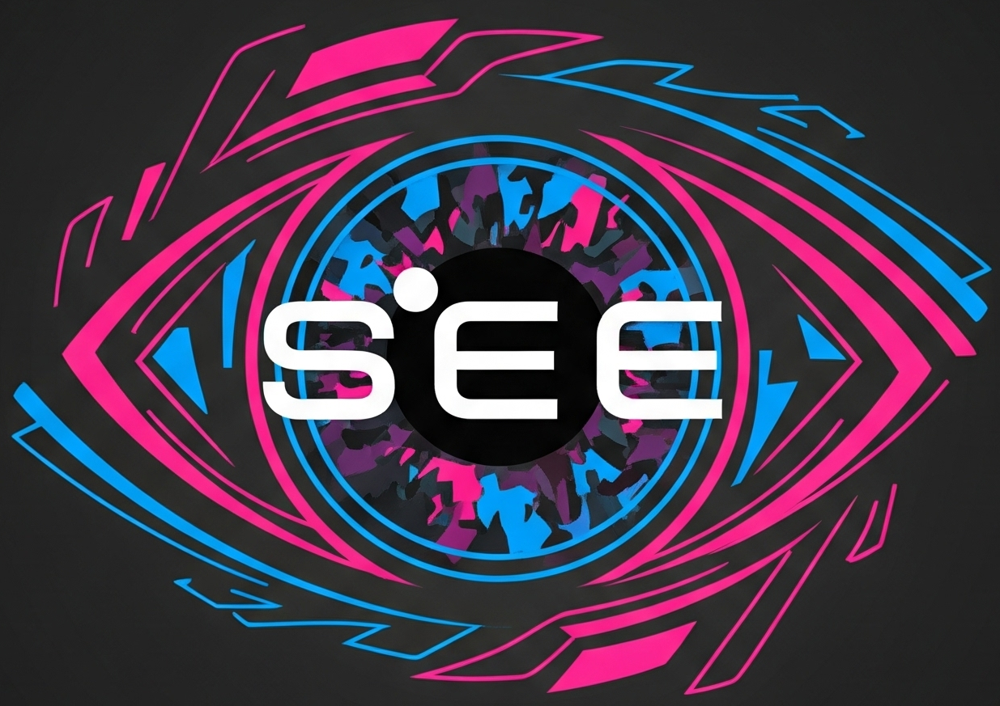
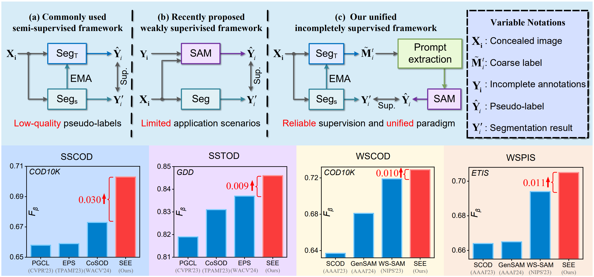
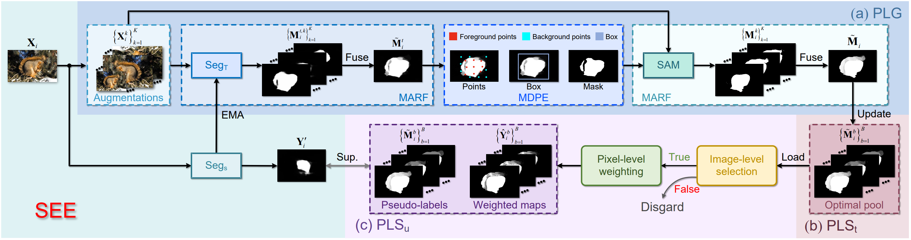
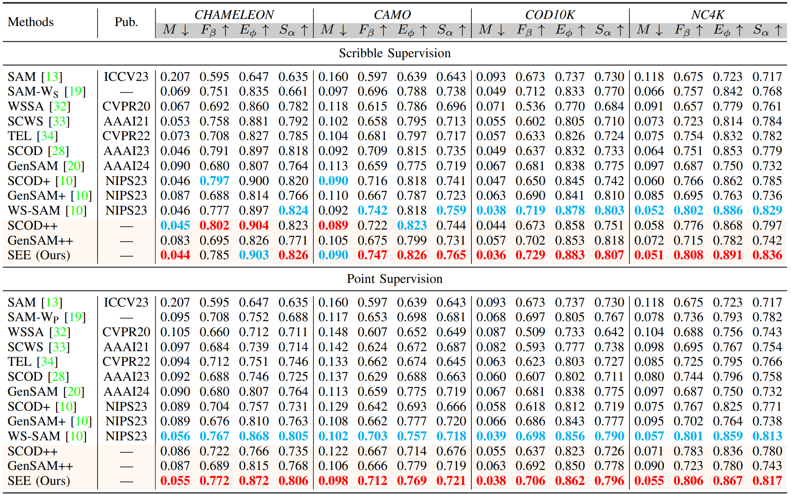
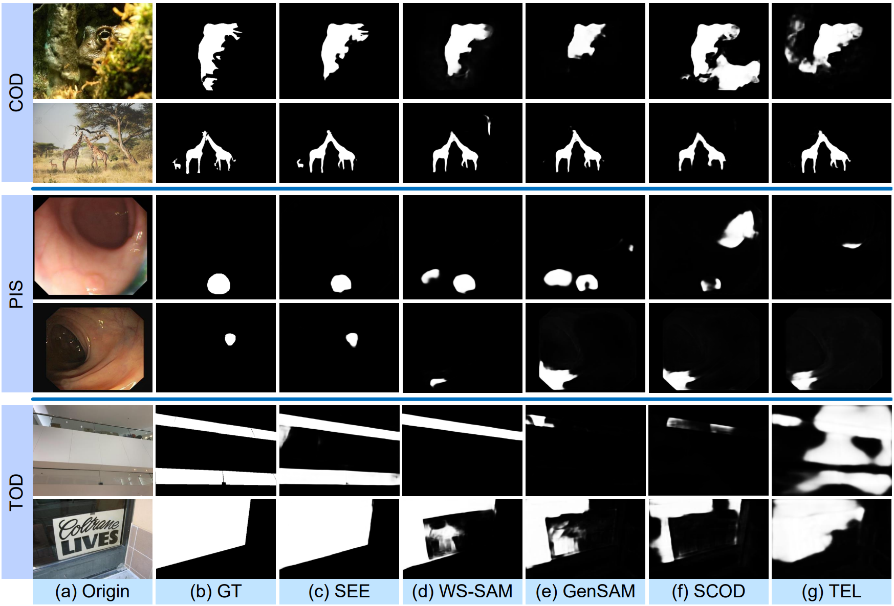

<p align=center> <a href='https://arxiv.org/pdf/2501.18783'></a> </p>

**Segment concealed object with incomplete supervision, TPAMI, 2025**

[Chunming He](https://chunminghe.github.io/), [Kai Li](https://scholar.google.com/citations?user=YsROc4UAAAAJ&hl=en), [Yachao Zhang](https://scholar.google.com/citations?user=a-I8c8EAAAAJ&hl=en), [Ziyun Yang](https://scholar.google.com/citations?user=G-AAVZEAAAAJ&hl=en), [Youwei Pang](https://scholar.google.com/citations?user=jdo9_goAAAAJ&hl=en), [Longxiang Tang](https://scholar.google.com/citations?user=3oMQsq8AAAAJ&hl=en), [Chengyu Fang](https://cnyvfang.github.io/), [Yulun Zhang](https://yulunzhang.com), [Linghe Kong](https://scholar.google.com/citations?hl=en&user=-wm2X-8AAAAJ), [Xiu Li](https://scholar.google.com/citations?user=Xrh1OIUAAAAJ&hl=en) and [Sina Farsiu](https://scholar.google.com/citations?user=mzcr92sAAAAJ&hl=en) 

The extended version of our previous NeurIPS 2023 paper—[WS-SAM](https://github.com/ChunmingHe/WS-SAM)!
>**Abstract:** Existing concealed object segmentation (COS) methods frequently utilize reversible strategies to address uncertain regions. However, these approaches are typically restricted to the mask domain, leaving the potential of the RGB domain underexplored. To address this, we propose the Reversible Unfolding Network (RUN), which applies reversible strategies across both mask and RGB domains through a theoretically grounded framework, enabling accurate segmentation. RUN first formulates a novel COS model by incorporating an extra residual sparsity constraint to minimize segmentation uncertainties. The iterative optimization steps of the proposed model are then unfolded into a multistage network, with each step corresponding to a stage. Each stage of RUN consists of two reversible modules: the Segmentation-Oriented Foreground Separation (SOFS) module and the Reconstruction-Oriented Background Extraction (ROBE) module. SOFS applies the reversible strategy at the mask level and introduces Reversible State Space to capture non-local information. ROBE extends this to the RGB domain, employing a reconstruction network to address conflicting foreground and background regions identified as distortion-prone areas, which arise from their separate estimation by independent modules. As the stages progress, RUN gradually facilitates reversible modeling of foreground and background in both the mask and RGB domains, directing the network's attention to uncertain regions and mitigating false-positive and false-negative results. Extensive experiments demonstrate the superior performance of RUN and highlight the potential of unfolding-based frameworks for COS and other high-level vision tasks.   





## 🔥 News

- **2025-06-04:** We release the code, the pretrained models, and the results.

- **2025-06-04:** We release this repository.


## 🔗 Contents

- [x] Usage
- [x] Results
- [x] Citation
- [x] Acknowledgements


## ⚙️ Usage


### 1. Prerequisites

> Note that SEE is only tested on Ubuntu OS with the following environments.

- Creating a virtual environment in terminal: `conda create -n SEE python=3.8`.
- Installing necessary packages: `conda env create -f environment.yml`


## 🔍 Results

We achieved state-of-the-art performance on *camouflaged object detection*, *polyp image segmentation*, *medical tubular object segmentation*, and *transparent object detection*. More results can be found in the paper.

<details>
<summary>Quantitative Comparison (click to expand)</summary>

- Results in Table 1 of the main paper
  <p align="center">
  
	</p>
  </details>

<details>
<summary>Visual Comparison (click to expand)</summary>

- Results in Figure 4 of the main paper
  <p align="center">
  
	</p>
  </details>


## Related Works
[RUN: Reversible Unfolding Network for Concealed Object Segmentation](https://github.com/ChunmingHe/Camouflageator), ICML 2025.

[Strategic Preys Make Acute Predators: Enhancing Camouflaged Object Detectors by Generating Camouflaged Objects](https://github.com/ChunmingHe/Camouflageator), ICLR 2024.

[Weakly-Supervised Concealed Object Segmentation with SAM-based Pseudo Labeling and Multi-scale Feature Grouping](https://github.com/ChunmingHe/WS-SAM), NeurIPS 2023.

[Camouflaged object detection with feature decomposition and edge reconstruction](https://github.com/ChunmingHe/FEDER), CVPR 2023.

[Concealed Object Detection](https://github.com/GewelsJI/SINet-V2), TPAMI 2022.

You can see more related papers in [awesome-COS](https://github.com/ChunmingHe/awesome-concealed-object-segmentation).


## 📎 Citation

If you find the code helpful in your research or work, please cite the following paper(s).

```
@article{he2025segment,
  title={Segment concealed object with incomplete supervision},
  author={He, Chunming and Li, Kai and Zhang, Yachao and Yang, Ziyun and Tang, Longxiang and Zhang, Yulun and Kong, Linghe and Farsiu, Sina},
  journal={TPAMI},
  year={2025}
}
```

## Concat
If you have any questions, please feel free to contact me via email at chunminghe19990224@gmail.com or chunming.he@duke.edu.

## Acknowledgement
The code is built on [WS-SAM](https://github.com/ChunmingHe/WS-SAM) and [FEDER](https://github.com/ChunmingHe/FEDER). Please also follow the corresponding licenses. Thanks for the awesome work.


